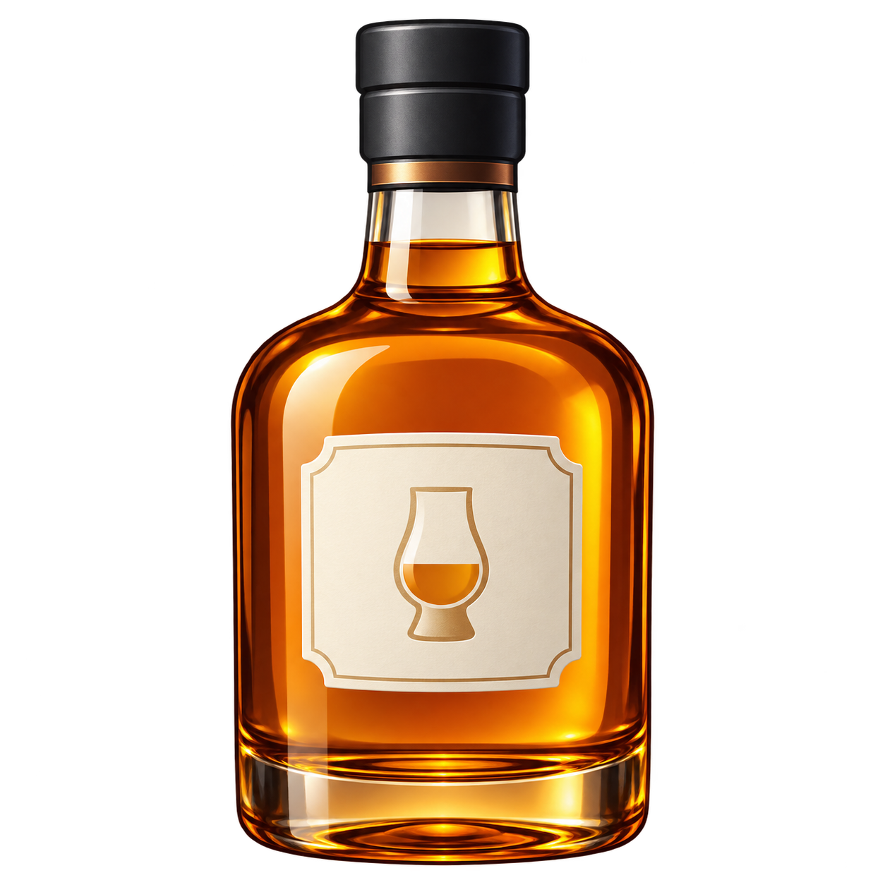

<div align="center">



# Whiskey Stack

### Know your shelf. Find your next pour.

A self-hosted whisky collection and discovery app for tracking bottles, exploring new styles, and finding current Dutch retailer prices.

[](https://nextjs.org/)
[](https://www.typescriptlang.org/)
[](https://neon.tech/)
[](LICENSE)

[Features](#features) · [Quick start](#quick-start) · [Deploy](#deploy-to-vercel) · [Configuration](#configuration) · [Architecture](#architecture) · [Creator](#creator) · [License](#license)

</div>

---

## About the project

Whiskey Stack keeps a personal whisky collection in one calm, searchable place. Add bottles to the shelf, wishlist what you want to try, record tasting details, and browse recommendations that broaden the collection.

The wishlist includes country groups plus dedicated **Unique choices** and **Luxury Whisky's** sections. Bottle photos open in a large view, card details include ABV, and saved retailer prices link directly to the cheapest verified offer found.

The app is designed for self-hosting. Your collection belongs to your account and every database query is scoped to the signed-in user.

## Features

| Area | What it does |
| --- | --- |
| **Collection** | Track shelf, finished bottles, tasting details, ratings, regions, and flavour tags. |
| **Wishlist** | Group bottles by country or special category, collapse sections, save target prices, and open photos at full size. |
| **Discovery** | Find bottles that broaden the collection across countries, styles, and categories. |
| **Prices** | Save verified 70cl retailer offers in euros and link directly to the store page. |
| **Insights** | See category, country, flavour, and distillery coverage. |
| **Flights** | Build tasting flights from bottles on the shelf and optionally share them. |
| **Sharing** | Publish an opt-in read-only shelf or tasting flight. |
| **Integrations** | Neon Postgres, Stack authentication, Gemini, OpenRouter, Resend, and Vercel Cron. |

<details>
<summary><strong>See the main workflows</strong></summary>

### Collection and wishlist

- Add a bottle manually or scan a label photo.
- Keep owned, wishlist, and finished statuses separate.
- Edit ABV, age, region, notes, flavour tags, ratings, and photos.
- Search the wishlist and collapse country or special-category sections.
- Set a target price for bottles you are watching.

### Discovery and pricing

- Ask AI for new bottles based on the shelf and missing categories.
- Save recommendations directly to the wishlist.
- Compare verified retailer offers where a current listing is available.
- Keep saved prices when an external provider is unavailable.

### Tasting and sharing

- Curate an ordered flight from bottles you own.
- Add per-pour tasting notes and a theme.
- Share a read-only flight link or an opt-in public shelf.

</details>

## Quick start

### Requirements

- Node.js 22 or newer
- npm
- PostgreSQL, preferably through [Neon](https://neon.tech/)
- Stack authentication credentials

```bash
git clone https://github.com/mstoof/whiskey_stack.git
cd whiskey_stack
npm install
cp .env.example .env.local
```

Fill in `.env.local`, then initialise the database and start the app:

```bash
set -a
source .env.local
set +a
npm run db:push
npm run dev
```

Open [http://localhost:3000](http://localhost:3000).

> [!NOTE]
> Drizzle Kit does not load `.env.local` automatically. Load it in your shell before running database commands.

## Deploy to Vercel

1. Fork or clone this repository.
2. Create a Neon Postgres project.
3. Import the repository into [Vercel](https://vercel.com/new).
4. Add the variables from `.env.example` to the Vercel project.
5. Set `NEXT_PUBLIC_SITE_URL` to the public site URL.
6. Run `npm run db:push` against the production database once.
7. Deploy and test sign-in, bottle creation, pricing, and sharing.

Use a separate Neon branch for preview deployments so previews cannot change production data.

## Configuration

Use [.env.example](.env.example) as the complete template.

| Variable | Required | Purpose |
| --- | --- | --- |
| `DATABASE_URL` | Yes | Neon/PostgreSQL connection string. |
| `NEXT_PUBLIC_SITE_URL` | Yes | Public URL used in links and sharing. |
| Stack auth variables | Yes | Authentication and account access. |
| `GEMINI_API_KEY` | No | Discovery, label recognition, and live search grounding. |
| `OPENROUTER_API_KEY` and `OPENROUTER_MODEL` | No | Optional AI fallback. |
| `RESEND_API_KEY` and `EMAIL_FROM` | No | Price-watch notification email. |
| `CRON_SECRET` | Required for price watch | Protects the scheduled price-watch endpoint. |

Without AI credentials, the core collection, wishlist, sharing, and tasting-flight features still work. Prices are only shown when the app has a verifiable retailer offer; it does not invent missing prices.

## Architecture

```text
app/                 Next.js routes, pages, API handlers, and auth handler
components/          Client views for collection, wishlist, discovery, and flights
lib/                 Database schema, serializers, AI providers, pricing, and validation
drizzle/             SQL migrations and Drizzle metadata
public/              Bottle photos and the whiskey favicon
scripts/             Data repair, discovery, image, and price maintenance scripts
```

The app uses Next.js App Router, React Server Components, TypeScript strict mode, Tailwind CSS, Drizzle ORM, Neon Postgres, and Stack authentication. User-owned rows are always filtered by the authenticated user ID. Public shelf and flight pages expose only their explicit, read-only fields.

## Development

```bash
npm run typecheck
npm run build
npm run db:generate
npm run db:push
```

Before opening a pull request, run the type check and production build. Keep secrets in `.env.local`; never commit them.

## Creator

<table>
  <tr>
    <td></td>
    <td><strong>Maurice Stoof</strong><br />Creator and maintainer of Whiskey Stack<br /><br />Cyber Security &amp; Engineering</td>
    <td><a href="https://github.com/mstoof">GitHub @mstoof</a><br /><a href="mailto:m.stoof@watchmen.io">m.stoof@watchmen.io</a></td>
  </tr>
</table>

Whiskey Stack started as a practical way to keep a growing bottle collection organised: one place for the shelf, the next bottle to try, tasting notes, and the price page to visit when it is time to buy.

Maurice works across cyber security and engineering, with a focus on building useful software that keeps personal data private and removes friction from everyday planning. Feedback, bug reports, and non-commercial contributions are welcome through GitHub.

## Contributing

Issues and pull requests for non-commercial use are welcome.

1. Create a fork.
2. Open a feature branch.
3. Make the smallest clear change that solves the problem.
4. Run the type check and production build.
5. Open a pull request with a short explanation and validation details.

## License

Whiskey Stack uses the [PolyForm Noncommercial License 1.0.0](LICENSE).

Personal use, education, research, hobby projects, and other non-commercial use are allowed. Commercial use, paid hosting, and selling the software require separate written permission.

---

<div align="center">

Built for people who would rather explore the next bottle than lose track of the ones they already own.

</div>
